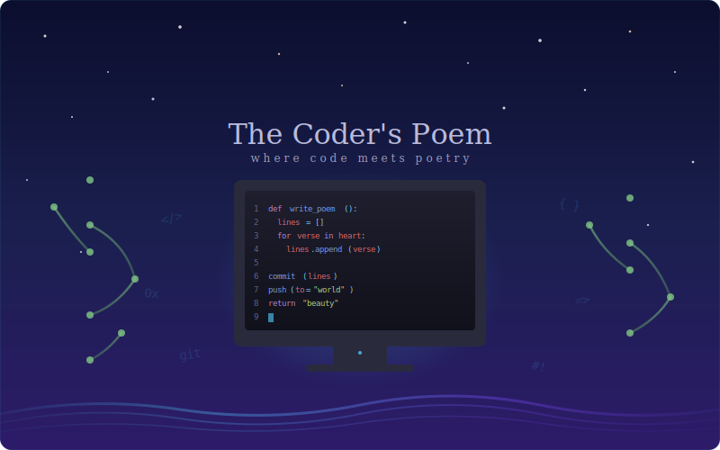

# Test-repository-
this is a test text.

## A Poem

  

Lines of code like rivers flow,
Through logic's path they twist and grow,
Each commit a stepping stone,
In this repo we call home.

A single branch begins to sprout,
Then forks and merges, twists about,
Through pull requests we shape the dream,
And build together, team by team.

The bugs may lurk in shadowed lines,
But patience finds the faintest signs,
A missing comma, bracket lost,
We fix them all, no matter the cost.

From empty files to systems vast,
Each function written, built to last,
The terminal hums its quiet song,
And carries us where we belong.

So here we code through day and night,
With monitors casting silver light,
For every repo tells a tale,
Of those who dared and did not fail.